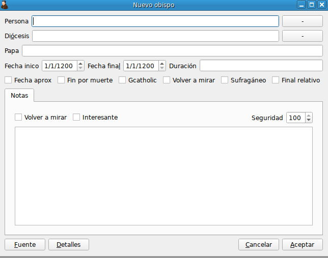

This is a program written in C++ for entering data into a [Postgresql
database](https://github.com/rogorido/dominicansdb) created for the
analysis of the Dominican Order in the early modern period.

The database is then used by an
[API](https://github.com/rogorido/apidominicans) and the results can be
analyzed in my webpage on [early modern
Dominicans](https://dominicans.georeligion.org).

Some of this code was written in the framework of the research project
on **Religious globalisation as challenge. Global governance,
geopolitics and costs in the Order of Preachers (1570-1700)**, led by me
and funded by the Spanish Ministry of Science and Innovation (Ref:
RTI2018-101224-B-I00).

The code is released under the [GNU General Public License version
3.0](https://www.gnu.org/licenses/gpl-3.0.html). 

